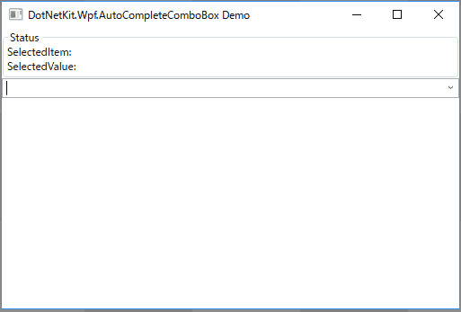

# AutoCompleteComboBox for WPF
Provides a lightweight combobox with filtering (auto-complete).

## Screenshot


## Usage
[Install via NuGet](https://www.nuget.org/packages/DotNetKit.Wpf.AutoCompleteComboBox).

Declare XML namespace.

```xml
<Window
    ...
    xmlns:dotNetKitControls="clr-namespace:DotNetKit.Windows.Controls;assembly=DotNetKit.Wpf.AutoCompleteComboBox"
    ... >
```

Then you can use `AutoCompleteComboBox` like a normal `ComboBox` (because of inheritance).

```xml
<dotNetKitControls:AutoCompleteComboBox
    SelectedValuePath="Id"
    TextSearch.TextPath="Name"
    ItemsSource="{Binding Items}"
    SelectedItem="{Binding SelectedItem}"
    SelectedValue="{Binding SelectedValue}"
    />
```

Note that:

- Set a property path to ``TextSearch.TextPath`` property.
    - The path leads to a property whose getter produces a string value to identify items. For example, assume each item is an instance of `Person`, which has `Name` property, and the property path is "Name". If the user input "va", the combobox filters the items to remove ones (persons) whose `Name` doesn't contains "va".
    - No support for ``TextSeach.Text``.
- Don't use ``ComboBox.Items`` property directly. Use `ItemsSource` instead.
- Although the Demo project uses DataTemplate to display items, you can also use `DisplayMemberPath`.

### Configuration
This library works fine in the default setting, however, it also provides how to configure.

- Define a class derived from [DotNetKit.Windows.Controls.AutoCompleteComboBoxSetting](DotNetKit.Wpf.AutoCompleteComboBox\Windows\Controls\AutoCompleteComboBoxSetting.cs) to override some of properties.
- Set the instance to ``AutoCompleteComboBox.Setting`` property.

```xml
<dotNetKitControls:AutoCompleteComboBox
    Setting="..."
    ...
    />
```
